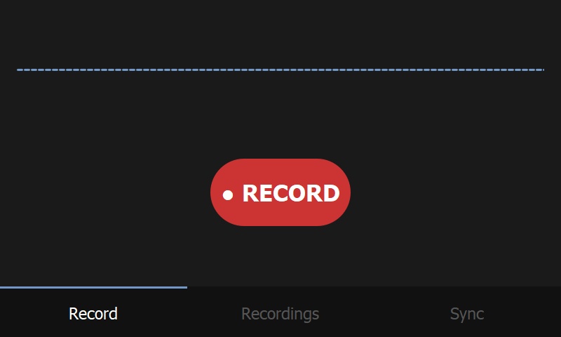
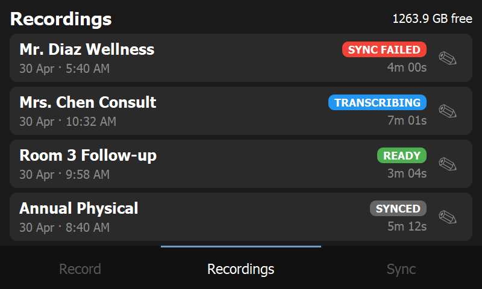
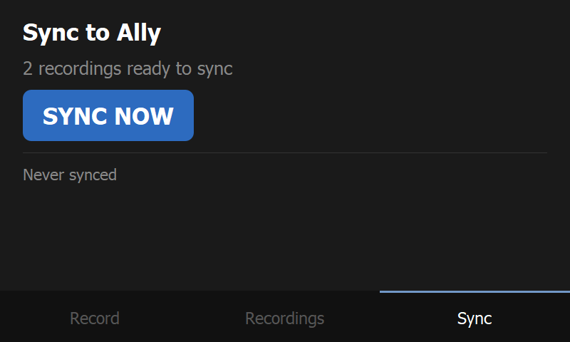
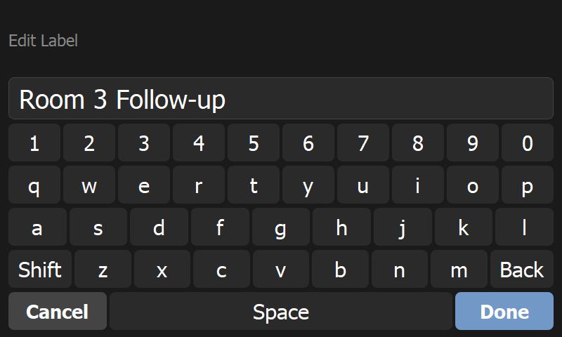

# Rendu

A two-device, fully local medical documentation system. A Raspberry Pi 5 with a 7-inch touchscreen records and transcribes patient encounters; an ASUS ROG Ally formats them into clinical notes using a local LLM. Nothing leaves the local network.

Designed and shipped with a spec-first, AI-augmented engineering workflow. I authored the design documents in this repo (architecture, data model, infrastructure, on-device behavior, network contract) before any code was written, then used Claude Code as the paired implementation agent to translate those specs into a working system.

## Screenshots

The Pi UI runs at the native 800x480 of the official 7-inch touchscreen. All four shots below are real renders of the app.

| | |
|---|---|
|  |  |
| Record screen, idle. | Recordings list with all four status badges (SYNCED, READY, TRANSCRIBING, SYNC FAILED). The pencil opens the on-screen keyboard for inline rename. |
|  |  |
| Sync screen with the pending count and the SYNC NOW action. | Custom in-app touch keyboard. No physical keyboard or system OSK required; works the same in DEV_MODE on Windows. |

## Why

Off-the-shelf medical scribes are cloud-based and subscription-priced. This project is a self-hosted alternative built for a single non-technical clinician, with simplicity and privacy as the primary constraints. No cloud APIs, no accounts, no subscriptions, no telemetry.

## Architecture

```
+----------------------+          LAN (mDNS)          +----------------------+
|   Raspberry Pi 5     |  ------------------------>   |   ASUS ROG Ally      |
|   7" touchscreen     |       POST /sync             |   Windows 11         |
|                      |       (audio + transcript)   |                      |
|   PyQt5 UI           |                              |   FastAPI + React    |
|   PyAudio capture    |                              |   SQLite             |
|   Whisper.cpp STT    |                              |   Ollama (llama3.1)  |
|                      |  <------------------------   |                      |
|                      |       200 OK                 |                      |
+----------------------+                              +----------------------+
```

The Pi is the capture device: tap to record, on-screen waveform, automatic local transcription, manual "Sync Now" to push to the Ally. The Ally is the read/edit device: it accepts the upload, runs the transcript through a local LLM for PHI redaction and structured-note formatting (SOAP, DAP, Epic, etc.), and serves a React UI in the browser for review and copy-paste into an EMR.

## Tech stack

**Pi side (`pi/`)**
- PyQt5 touchscreen UI sized for 800x480
- PyAudio + Whisper.cpp for local capture and transcription
- SQLite via stdlib `sqlite3`
- Custom in-app on-screen keyboard (no physical keyboard required)
- systemd auto-start on boot

**Ally side (`ally/app/`)**
- FastAPI backend, packaged as a single Windows exe via PyInstaller
- React + Vite frontend
- SQLAlchemy + SQLite
- Ollama (default model: `llama3.1:8b`) for PHI redaction and note formatting
- Multi-template note formats with per-format prompts

**Network**
- mDNS hostname resolution (`rendu-ally.local`) so the Pi can find the Ally without IP configuration

## Repo layout

```
ally/
  app/                  Backend code, frontend source, build scripts
  rendu_backend_spec.md
  rendu_data_model.md
  rendu_frontend_integration.md
  rendu_mdns_setup.md
  rendu_settings_spec.md
pi/
  main.py               PyQt5 entry point
  screens/              Record, Recordings list, Sync, on-screen keyboard
  services/             Audio, transcription, sync, storage
  database.py
  config.py
  install.sh            One-shot Pi installer
  rendu-pi.service      systemd unit
  rendu_pi_spec.md
  tests/                pytest suite (29 tests)
```

## Running it locally

The Pi side runs on Windows in `DEV_MODE` with mocked audio and Whisper, so you can iterate on the UI without a Pi or a microphone:

```bash
cd pi
pip install -r requirements.txt
python main.py
```

`DEV_MODE` is auto-detected on non-Linux hosts. Recordings use a synthetic 440 Hz tone; transcription returns canned text after a short delay.

The Ally side runs as a normal FastAPI app:

```bash
cd ally/app
pip install -r requirements.txt
uvicorn main:app --reload
```

Frontend dev server:

```bash
cd ally/app/frontend
npm install
npm run dev
```

## Tests

```bash
cd pi
pytest
```

29 tests cover the database layer, audio mock, storage, sync service, and Whisper subprocess wrapper. The UI itself is exercised by hand against `DEV_MODE`.

## Engineering process

Spec-first, with a clear division of labor between the engineer and the AI agent.

Before any code was written, I authored the six design documents in this repo. I defined the architecture (two-device split, local-only data flow), the data model (SQLite schemas, status state machines, lifecycle transitions), the infrastructure (mDNS discovery, systemd auto-start, PyInstaller packaging, Whisper.cpp pipeline, Ollama integration), the on-device UX (screens, gestures, touch targets at 800x480, on-screen keyboard contract), and the network contract between the Pi and the Ally. These specs are the artifacts that drove implementation.

With the specs in place, I used Claude Code as the implementation agent against a tests-first loop. The agent wrote the code; I drove the loop:

1. Lift acceptance criteria from a spec section into a failing pytest scaffold.
2. Have Claude Code generate a diff that satisfies the failing tests, with the relevant spec passed in as context.
3. Review the diff against the spec, push back on shortcuts, and require fixes for edge cases the spec calls out (mic-unplugged guards, idle-time accounting on pause, scroll-versus-long-press disambiguation).
4. Update the spec when implementation revealed a gap, so the doc stays authoritative for the next iteration.

The architecture, data model, infrastructure, and design decisions are mine. Claude Code translated them into Python, PyQt, FastAPI, and React under that loop.

## Design documents

I wrote these specs as the authoritative source for implementation and as the input context for any future iteration:

- [pi/rendu_pi_spec.md](pi/rendu_pi_spec.md) - Pi UI screens, gestures, audio pipeline, on-screen keyboard, error handling
- [ally/rendu_backend_spec.md](ally/rendu_backend_spec.md) - FastAPI routes, Ollama integration, sync contract
- [ally/rendu_data_model.md](ally/rendu_data_model.md) - SQLite schema and lifecycle
- [ally/rendu_frontend_integration.md](ally/rendu_frontend_integration.md) - React-to-API contract
- [ally/rendu_mdns_setup.md](ally/rendu_mdns_setup.md) - LAN discovery
- [ally/rendu_settings_spec.md](ally/rendu_settings_spec.md) - Configuration surface

## Status

In active use by the target clinician. The system handles the full record-transcribe-sync-format-review loop. Future work includes a richer note editor on the Ally side and a graceful-shutdown path on the Pi to handle power-loss mid-recording. New work follows the same spec-first, agent-paired loop described above.
